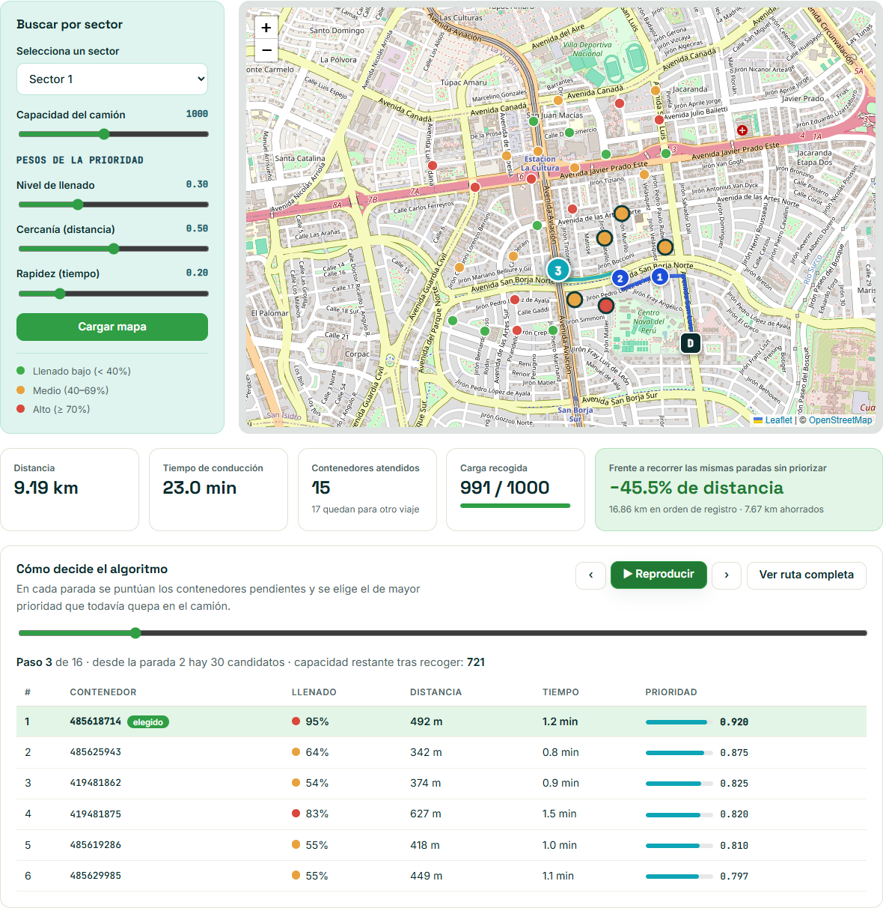
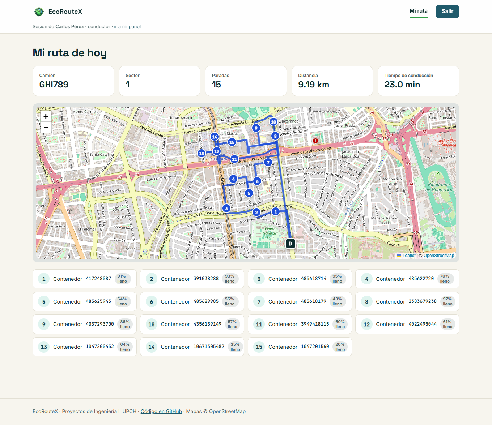
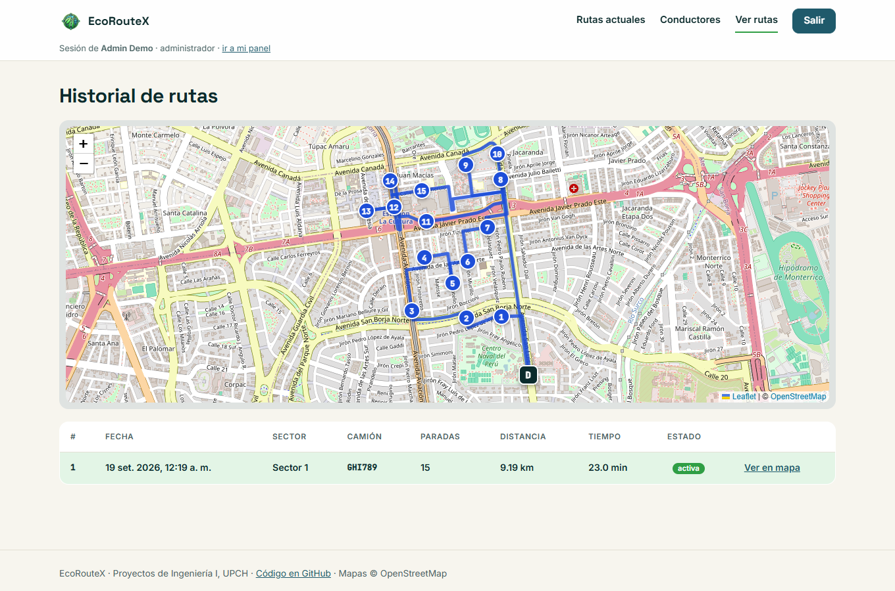

# EcoRouteX

**Rutas inteligentes para la recolección de residuos sólidos en San Borja, Lima.**

EcoRouteX decide qué contenedores de basura debe visitar un camión compactador y en qué orden, según qué tan llenos están y qué tan lejos quedan, y traza el recorrido calle por calle sobre la red vial real de OpenStreetMap.

> **Demo en vivo:** _pendiente de desplegar — ver [Despliegue](#despliegue)_
> Usuarios de prueba: administrador `70000001` / `admin123` · conductor `12345678` / `conductor123`



## El problema

En el Perú, a los camiones recolectores se les indica qué puntos visitar, pero no el camino más eficiente. El resultado son más horas de operación, más combustible y más emisiones: el transporte genera el 40 % de las emisiones del país relacionadas con energía. El análisis completo está en [Entregables/Avance_Proyecto.md](Entregables/Avance_Proyecto.md).

## Cómo funciona

1. **La ciudad como grafo.** La red vial de San Borja (1 364 intersecciones, 3 196 tramos) se descarga una vez de OpenStreetMap y se guarda en el repositorio.
2. **Contenedores con nivel de llenado.** Cada contenedor es un nodo del grafo. La tabla `tiempos` guarda la distancia y el tiempo por calles entre los contenedores de cada sector.
3. **Heurística voraz con prioridad.** Desde donde está el camión se puntúa cada contenedor pendiente y se visita el de mayor puntaje que todavía quepa:

   ```
   prioridad = 0.3·llenado + 0.5·(1 − distancia) + 0.2·(1 − tiempo)     (cada factor normalizado a 0–1)
   ```

4. **Dijkstra entre paradas.** El camino exacto por las calles entre una parada y la siguiente es el más corto según Dijkstra. Cuando el camión se llena, regresa al depósito.

La demo permite mover los tres pesos, ver cada decisión paso a paso con sus candidatos, y comparar el resultado contra recorrer las mismas paradas en orden de registro.

## Funcionalidades

| | |
|---|---|
| **Landing pública** | Explica el proyecto e incluye la demo interactiva, sin necesidad de cuenta. |
| **Administrador** | Calcula rutas por sector, las guarda y asigna a un camión, revisa el historial y la lista de conductores. |
| **Conductor** | Ve la ruta activa asignada a su camión, con el orden de las paradas. |

| Panel del conductor | Historial de rutas |
|---|---|
|  |  |

## Stack

| Capa | Tecnología |
|---|---|
| Frontend | React 19, Vite, React Router, Leaflet (react-leaflet), CSS propio |
| Backend | Python 3.12, FastAPI, SQLAlchemy 2, NetworkX, JWT + bcrypt |
| Base de datos | PostgreSQL en [Neon](https://neon.tech) |
| Datos geográficos | OpenStreetMap vía OSMnx (solo para generar el grafo) |
| Infraestructura | Render (API en Docker + sitio estático), GitHub Actions (CI y keep-alive) |

## Estructura

```
backend/
  ecoroutex/        Motor: algoritmo.py (heurística) y grafo.py (Dijkstra, geometría)
  app/              API FastAPI: routers, modelos, seguridad
  scripts/          seed.py (esquema + datos demo) y build_graph.py (grafo desde OSM)
  sql/schema.sql    Esquema PostgreSQL con los triggers de asignación de camiones
  data/             Grafo vial de San Borja precalculado (98 KB)
  tests/            Pruebas del algoritmo y de la API
frontend/           Aplicación React
SoftWare/legacy/    Código original de 2024 (AWS Lambda, notebooks, MySQL)
Entregables/ · Presentación/ · Documentacion/ · Tareas/   Material del curso
render.yaml         Blueprint de despliegue
```

## Instalación local

Requisitos: Python 3.12+, Node 20+ y una base de datos PostgreSQL (el plan gratuito de Neon basta).

### 1. Backend

```bash
cd backend
python -m venv .venv
.venv\Scripts\activate            # Linux/macOS: source .venv/bin/activate
pip install -r requirements.txt
cp .env.example .env              # y completa los valores
python -m scripts.seed            # crea las tablas y carga los datos de demostración
uvicorn app.main:app --reload
```

La API queda en http://127.0.0.1:8000 y su documentación interactiva en `/docs`.

| Variable | Descripción |
|---|---|
| `DATABASE_URL` | Cadena de conexión de PostgreSQL, tal como la entrega Neon. |
| `JWT_SECRET` | Clave para firmar los tokens: `python -c "import secrets; print(secrets.token_urlsafe(48))"` |
| `CORS_ORIGINS` | Orígenes del frontend separados por coma. En local: `http://localhost:5173` |

`python -m scripts.seed --reset` borra y recrea las tablas. Los datos son reproducibles (semilla fija): 128 contenedores en 4 sectores, 5 camiones, 5 conductores y 1 administrador.

### 2. Frontend

```bash
cd frontend
npm install
cp .env.example .env              # VITE_API_URL=http://127.0.0.1:8000
npm run dev
```

Abre http://localhost:5173.

### Pruebas

```bash
cd backend
pip install -r requirements-dev.txt
pytest          # usa SQLite en memoria, no toca tu base de datos
ruff check .
```

`requirements-dev.txt` incluye OSMnx, que solo hace falta para regenerar el grafo con `python -m scripts.build_graph`.

## API

| Método | Ruta | Acceso | Descripción |
|---|---|---|---|
| `POST` | `/auth/login` | público | DNI + contraseña → token JWT |
| `GET` | `/contenedores?sector=` | público | Depósito y contenedores activos |
| `POST` | `/rutas/optimizar` | público | Calcula la ruta; solo un administrador puede guardarla (`guardar: true`) |
| `GET` | `/rutas` · `/rutas/{id}` | administrador | Historial y detalle con geometría |
| `GET` | `/rutas/mi-ruta` | conductor | Ruta activa de su camión |
| `GET` | `/conductores` | administrador | Conductores con su camión |
| `GET` | `/health` | público | Estado del servicio |

## Despliegue

El repositorio incluye un [blueprint de Render](render.yaml) que crea la API (Docker) y el frontend (sitio estático, que nunca se duerme).

1. **Neon:** crea un proyecto y copia la cadena de conexión. Desde tu máquina, con esa cadena en `backend/.env`, ejecuta `python -m scripts.seed`.
2. **Render:** *New → Blueprint* → elige este repositorio. Te pedirá tres valores:
   - `DATABASE_URL`: la cadena de Neon.
   - `VITE_API_URL`: la URL de la API, p. ej. `https://ecoroutex-api.onrender.com`.
   - `CORS_ORIGINS`: la URL del frontend, p. ej. `https://ecoroutex.onrender.com`.

   Si Render asigna nombres distintos (porque ya estaban tomados), corrige ambas variables en *Environment* y vuelve a desplegar el frontend.
3. **Keep-alive:** el plan gratuito de Render duerme la API tras 15 minutos sin tráfico.
   - En GitHub: *Settings → Secrets and variables → Actions → Variables* → crea `API_URL` con la URL de la API. El workflow [keepalive.yml](.github/workflows/keepalive.yml) hace ping cada 10 minutos.
   - Respaldo recomendado: un monitor HTTP gratuito en [UptimeRobot](https://uptimerobot.com) apuntando a `<API_URL>/health` cada 5 minutos (GitHub pausa los workflows programados tras 60 días sin commits).

   Aun si la API está dormida, el frontend carga de inmediato y muestra «Despertando el servidor…» mientras tanto.

## Limitaciones conocidas

- Los niveles de llenado son simulados; el proyecto original contemplaba sensores en los contenedores, que no se implementaron.
- El algoritmo es una heurística voraz: rápida y explicable, pero no garantiza la ruta óptima global.
- El tiempo estimado es solo de conducción (tope de 25 km/h y 30 s por semáforo); no incluye el tiempo de carga en cada contenedor.
- El límite de intentos de login vive en memoria: sirve para una sola instancia.

## Origen del proyecto

EcoRouteX nació en 2024 como proyecto grupal del curso **Proyectos de Ingeniería I** de la **Universidad Peruana Cayetano Heredia**. La versión original corría sobre AWS Lambda + EFS, MySQL y un frontend en AWS Amplify; ese código se conserva en [SoftWare/legacy](SoftWare/legacy), con una tabla que indica a dónde fue a parar cada pieza. Esta versión mantiene el algoritmo, el modelo de datos y el diseño de las pantallas, y reemplaza la infraestructura por una que se puede instalar y desplegar gratis.

### Equipo

- Arquiño Cerna, Noemi Salomina
- Aybar Escobar, Edithson Ricardo
- Colla Cervantes, Marelly Massiel
- Quezada Marceliano, Gian Carlos
- Salazar Cobian, Arny Eliu

El [marco teórico](Documentacion/marco_teorico.md) (grafos, Dijkstra, sistemas de coordenadas y protocolos) y la [presentación final](Presentación) forman parte del material del curso.

Datos de mapas © [OpenStreetMap](https://www.openstreetmap.org/copyright) contributors.
